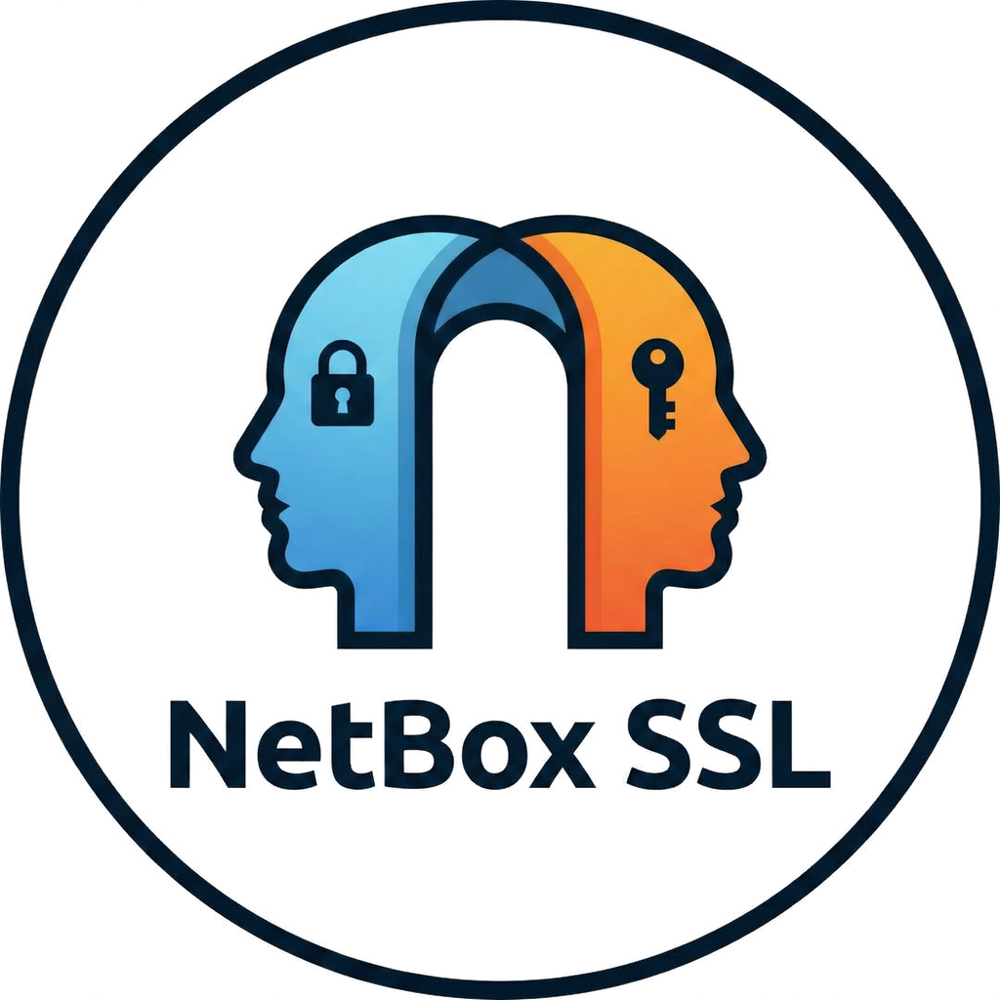

<p align="center">
  
</p>

<h1 align="center">NetBox SSL Plugin</h1>

<p align="center">
  <strong>Project Janus</strong> — Your Single Source of Truth for TLS/SSL certificate management in NetBox
</p>

<p align="center">
  <a href="https://github.com/ctrl-alt-automate/netbox-ssl/actions/workflows/ci.yml"></a>
  <a href="https://opensource.org/licenses/Apache-2.0"></a>
  <a href="https://github.com/netbox-community/netbox"></a>
</p>

<p align="center">
  <em>Named after Janus, the Roman god of doorways and transitions — because every certificate guards a doorway, and every renewal is a transition.</em>
</p>

---

<p align="center">
  
</p>

## ✨ Why NetBox SSL?

Managing SSL certificates across your infrastructure shouldn't be a scavenger hunt. NetBox SSL brings **visibility** and **control** to your certificate lifecycle:

- 🔍 **See everything at a glance** — Know which certificates are expiring, where they're deployed, and who owns them
- 🔄 **Painless renewals** — The Janus workflow transfers all assignments automatically when you renew
- 🔒 **Security first** — Private keys are never stored, only location hints for your secret management system
- 🎯 **Deep integration** — Certificates link directly to NetBox Services, Devices, and VMs

## 🚀 Quick Start

```bash
pip install netbox-ssl
```

Add to your `configuration.py`:

```python
PLUGINS = ["netbox_ssl"]
```

Run migrations and restart NetBox:

```bash
python manage.py migrate netbox_ssl
sudo systemctl restart netbox netbox-rq
```

**That's it!** Navigate to *Plugins > SSL Certificates* in your NetBox.

📖 **Full documentation:** [GitHub Wiki](https://github.com/ctrl-alt-automate/netbox-ssl/wiki)

## 📸 Screenshots

<table>
  <tr>
    <td align="center">
      <br>
      <em>Certificate details with validity and assignments</em>
    </td>
    <td align="center">
      <br>
      <em>Smart Paste import with automatic X.509 parsing</em>
    </td>
  </tr>
  <tr>
    <td align="center">
      <br>
      <em>Dashboard widget showing certificate health</em>
    </td>
    <td align="center">
      <br>
      <em>Track which certificates are assigned where</em>
    </td>
  </tr>
</table>

## 🎯 Key Features

### Smart Paste Import
Just paste your PEM certificate — the plugin extracts everything automatically: Common Name, SANs, validity dates, issuer chain, fingerprints, and more.

### Janus Renewal Workflow
When you import a renewed certificate (same CN as an existing one), the plugin offers to:
- **Transfer all assignments** from the old certificate
- **Archive the old certificate** with "Replaced" status
- **Link them together** for audit trail

### Certificate Assignments
Link certificates to the objects that use them:
- **Services** (recommended) — Port-level granularity (e.g., HTTPS on port 443)
- **Devices** — Physical servers and appliances
- **Virtual Machines** — VMs in your virtualization clusters

### Expiry Dashboard Widget
Add the widget to your NetBox dashboard to see:
- 🔴 **Critical** — Expiring within 14 days
- 🟠 **Warning** — Expiring within 30 days
- ⚫ **Orphan** — Certificates without assignments

### Security by Design
- **No private key storage** — Private keys never touch the database
- **Private key rejection** — PEM input with private keys is blocked
- **Key location hints** — Document where keys are stored (e.g., `vault:secret/certs/example.com`)

## 📊 Compatibility

| NetBox Version | Plugin Version | Status |
|:--------------:|:--------------:|:------:|
| 4.5.x          | 0.1.x          | ✅ Primary |
| 4.4.x          | 0.1.x          | ✅ Supported |
| 4.3.x and older| —              | ❌ Unsupported |

## 📚 Documentation

Full documentation is available in the [GitHub Wiki](https://github.com/ctrl-alt-automate/netbox-ssl/wiki):

- **[Installation](https://github.com/ctrl-alt-automate/netbox-ssl/wiki/Installation)** — Get up and running
- **[Configuration](https://github.com/ctrl-alt-automate/netbox-ssl/wiki/Configuration)** — Customize expiry thresholds and more
- **[Usage Guide](https://github.com/ctrl-alt-automate/netbox-ssl/wiki/Usage)** — Learn the workflows
- **[API Reference](https://github.com/ctrl-alt-automate/netbox-ssl/wiki/API)** — REST API and GraphQL
- **[Data Models](https://github.com/ctrl-alt-automate/netbox-ssl/wiki/Data-Models)** — Database schema details
- **[Development](https://github.com/ctrl-alt-automate/netbox-ssl/wiki/Development)** — Contributing guide

## 🛠️ Development

```bash
# Clone and start development environment
git clone https://github.com/ctrl-alt-automate/netbox-ssl.git
cd netbox-ssl
docker compose up -d

# Access NetBox at http://localhost:8000
# Login: admin / admin
```

See the [Development Guide](https://github.com/ctrl-alt-automate/netbox-ssl/wiki/Development) for more details.

## 🤝 Contributing

Contributions are welcome! Please:

1. Fork the repository
2. Create a feature branch from `dev`
3. Make your changes with tests
4. Submit a pull request

## 📄 License

Apache License 2.0

## 🙏 Acknowledgments

- The [NetBox](https://github.com/netbox-community/netbox) community for the excellent plugin framework
- The [`cryptography`](https://cryptography.io/) library for robust X.509 parsing
