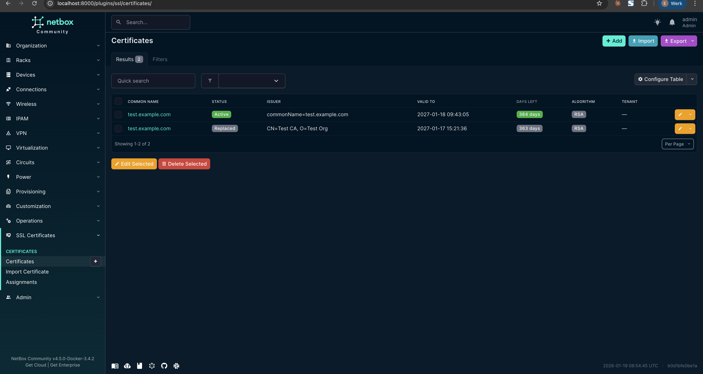
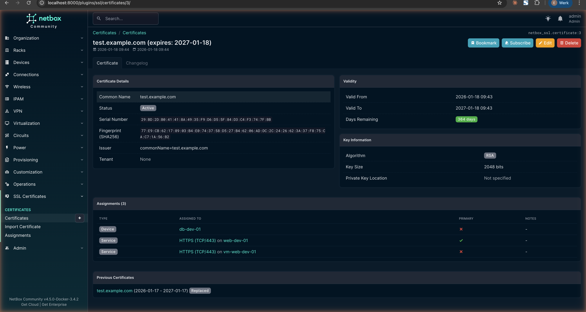
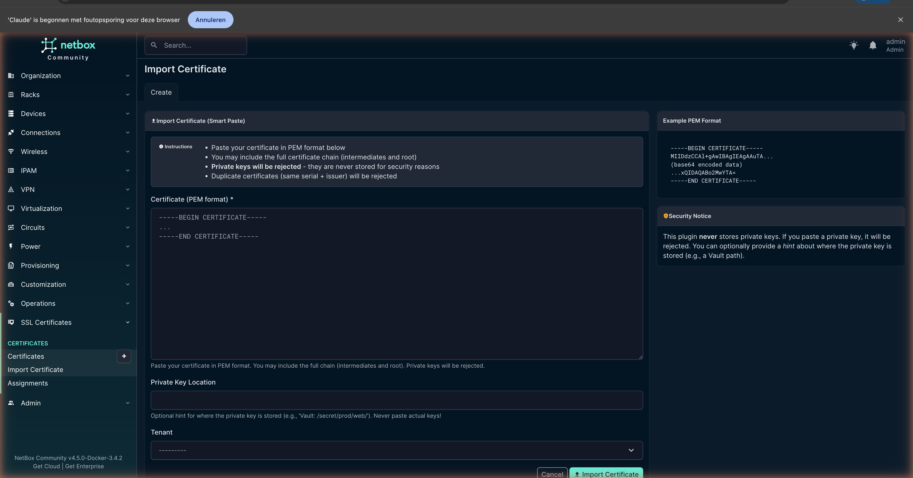
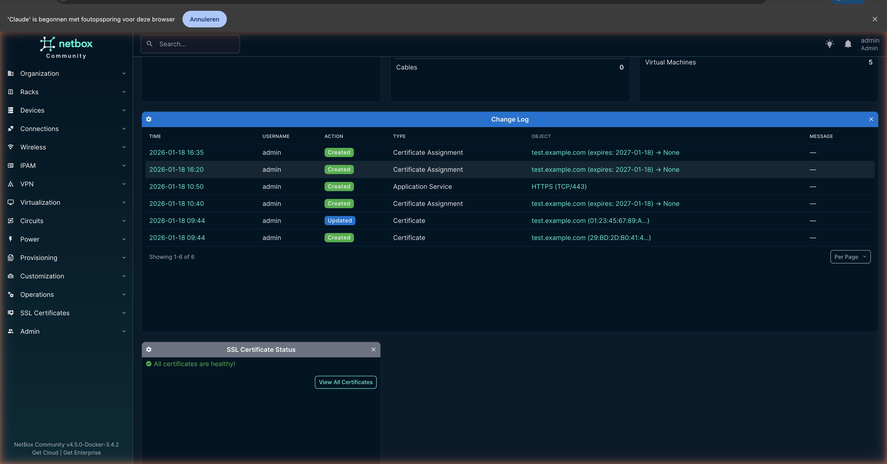
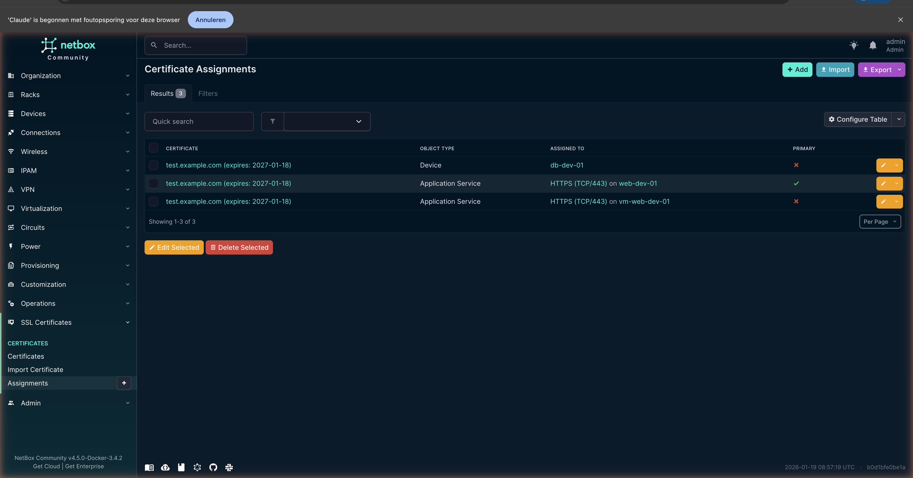

<h1 align="center">NetBox SSL Plugin</h1>

<p align="center">
  <strong>Project Janus</strong> — Your Single Source of Truth for TLS/SSL certificate management in NetBox
</p>

<p align="center">
  <a href="https://pypi.org/project/netbox-ssl/"></a>
  <a href="https://pypi.org/project/netbox-ssl/"></a>
  <a href="https://github.com/ctrl-alt-automate/netbox-ssl/actions/workflows/ci.yml"></a>
  <a href="https://opensource.org/licenses/Apache-2.0"></a>
  <a href="https://github.com/netbox-community/netbox"></a>
  
</p>

<p align="center">
  <em>Named after Janus, the Roman god of doorways and transitions — because every certificate guards a doorway, and every renewal is a transition.</em>
</p>

---

<p align="center">
  
</p>

## ✨ Why NetBox SSL?

Managing SSL certificates across your infrastructure shouldn't be a scavenger hunt. NetBox SSL brings **visibility** and **control** to your certificate lifecycle:

- 🔍 **See everything at a glance** — Know which certificates are expiring, where they're deployed, and who owns them
- 🔄 **Painless renewals** — The Janus workflow transfers all assignments automatically when you renew
- 🔒 **Security first** — Private keys are never stored, only location hints for your secret management system
- 🎯 **Deep integration** — Certificates link directly to NetBox Services, Devices, and VMs

## Requirements

| Dependency | Version |
|------------|---------|
| NetBox     | 4.4.0 - 4.5.x |
| Python     | 3.10+ |

The plugin uses the Python [`cryptography`](https://cryptography.io/) library for X.509 certificate parsing (installed automatically as a dependency).

## Installation

```bash
pip install netbox-ssl
```

Add to your `configuration.py`:

```python
PLUGINS = ["netbox_ssl"]
```

Run migrations and restart NetBox:

```bash
python manage.py migrate netbox_ssl
sudo systemctl restart netbox netbox-rq
```

**That's it!** Navigate to *Plugins > SSL Certificates* in your NetBox.

📖 **Full documentation:** [docs/](docs/index.md)

## ⚙️ Configuration

Customize the plugin via `PLUGINS_CONFIG` in your `configuration.py`:

```python
PLUGINS_CONFIG = {
    "netbox_ssl": {
        "expiry_warning_days": 30,   # Days before expiry → Warning status
        "expiry_critical_days": 14,  # Days before expiry → Critical status
    },
}
```

| Option | Type | Default | Description |
|--------|------|---------|-------------|
| `expiry_warning_days` | Integer | 30 | Certificates expiring within this many days show warning status |
| `expiry_critical_days` | Integer | 14 | Certificates expiring within this many days show critical status |
| `notification_email_enabled` | Boolean | False | Enable email notifications for expiry reports |
| `notification_email_recipients` | List | [] | Default email recipients for notifications |
| `bulk_import_max_batch_size` | Integer | 100 | Maximum certificates per bulk import request |
| `expiry_scan_thresholds` | List | [14, 30, 60, 90] | Days-before-expiry thresholds for the expiry scan script |
| `expiry_scan_cooldown_hours` | Integer | 24 | Minimum hours between duplicate event notifications |

See [Configuration](docs/configuration.md) for more options including custom fields, permissions, and webhooks.

## 📸 Screenshots

<table>
  <tr>
    <td align="center">
      <br>
      <em>Certificate details with validity and assignments</em>
    </td>
    <td align="center">
      <br>
      <em>Smart Paste import with automatic X.509 parsing</em>
    </td>
  </tr>
  <tr>
    <td align="center">
      <br>
      <em>Dashboard widget showing certificate health</em>
    </td>
    <td align="center">
      <br>
      <em>Track which certificates are assigned where</em>
    </td>
  </tr>
</table>

## Features

### Smart Paste Import
Just paste your PEM certificate — the plugin extracts everything automatically: Common Name, SANs, validity dates, issuer chain, fingerprints, and more.

### Janus Renewal Workflow
When you import a renewed certificate (same CN as an existing one), the plugin offers to:
- **Preview assignments** that will be transferred in a detailed table
- **Transfer all assignments** from the old certificate atomically
- **Archive the old certificate** with "Replaced" status
- **Link them together** for audit trail

Start a renewal directly from the certificate detail page with the **Renew** button.

### Certificate Authority Tracking
Track your CAs (Let's Encrypt, DigiCert, Sectigo, internal CAs) with automatic detection based on issuer patterns.

### Certificate Signing Requests (CSR)
Track pending certificate requests through their lifecycle: Pending, Approved, Rejected, Issued.

### Chain Validation
Validate certificate chains for completeness, signature correctness, and expiry.

### Compliance Reporting
Define compliance policies (minimum key size, forbidden algorithms, max validity, etc.) and run checks across your certificate inventory. 10 built-in policy types with severity levels and scoring.

### Data Export
Export certificates in CSV, JSON, YAML, or PEM bundle format with configurable field selection.

### Bulk CSV/JSON Import
Import certificate metadata from CSV or JSON files — paste content or upload a file. Two-step workflow with preview and validation before creating certificates. Also available via API.

### ACME Certificate Monitoring
Track Let's Encrypt and other ACME-issued certificates with auto-detection, renewal status, and provider metadata. Supports 7+ ACME providers.

### Email Notifications
Receive email alerts when certificates are expiring. Configurable recipients, thresholds, and subject prefix. Sends HTML + plain-text reports.

### Certificate Assignments
Link certificates to the objects that use them:
- **Services** (recommended) — Port-level granularity (e.g., HTTPS on port 443)
- **Devices** — Physical servers and appliances
- **Virtual Machines** — VMs in your virtualization clusters

### Expiry Dashboard Widget
Add the widget to your NetBox dashboard to see:
- 🔴 **Critical** — Expiring within 14 days
- 🟠 **Warning** — Expiring within 30 days
- ⚫ **Orphan** — Certificates without assignments

### Security by Design
- **No private key storage** — Private keys never touch the database
- **Private key rejection** — PEM input with private keys is blocked
- **Key location hints** — Document where keys are stored (e.g., `vault:secret/certs/example.com`)

## 📊 Compatibility

| NetBox Version | Plugin Version | Status |
|:--------------:|:--------------:|:------:|
| 4.5.x          | 0.6.x          | ✅ Primary |
| 4.4.x          | 0.6.x          | ✅ Supported |
| 4.3.x and older| —              | ❌ Unsupported |

## 📚 Documentation

Full documentation is available in the [docs/](docs/index.md) folder:

- **[Installation](docs/installation.md)** — Get up and running
- **[Configuration](docs/configuration.md)** — Customize expiry thresholds and more
- **[Usage Guide](docs/usage.md)** — Learn the workflows
- **[API Reference](docs/api.md)** — REST API and GraphQL
- **[Custom Scripts](docs/scripts.md)** — Expiry notifications and scheduling
- **[Data Models](docs/data-models.md)** — Database schema details
- **[Contributing](CONTRIBUTING.md)** — Contribution guidelines

## 🛠️ Development

```bash
# Clone and start development environment
git clone https://github.com/ctrl-alt-automate/netbox-ssl.git
cd netbox-ssl
docker compose up -d

# Access NetBox at http://localhost:8000
# Login: admin / admin
```

See [CONTRIBUTING.md](CONTRIBUTING.md) for more details.

## 🤝 Contributing

Contributions are welcome! Please:

1. Fork the repository
2. Create a feature branch from `dev`
3. Make your changes with tests
4. Submit a pull request

## 📄 License

Apache License 2.0

## 🙏 Acknowledgments

- The [NetBox](https://github.com/netbox-community/netbox) community for the excellent plugin framework
- The [`cryptography`](https://cryptography.io/) library for robust X.509 parsing
