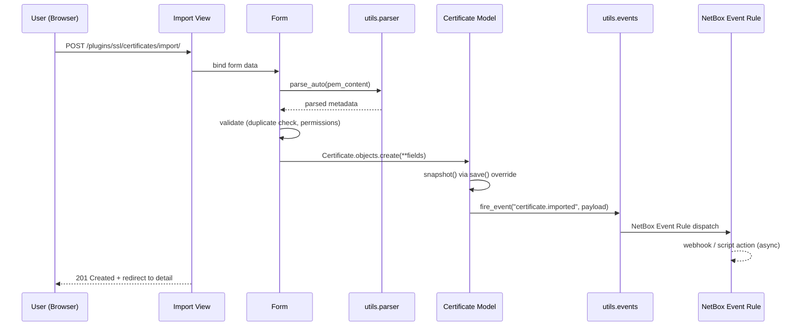
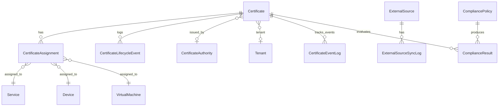

# Architecture

This document describes how NetBox SSL is organised internally — the layer model,
the utility boundaries, and the data flow for a certificate import. It's aimed at
contributors and integrators who want to understand the plugin without reading
every file.

## Layer model

NetBox SSL follows the standard NetBox plugin layer model:

```
┌─────────────────────────────────────────┐
│  Templates (HTML, Jinja2)               │  presentation
├─────────────────────────────────────────┤
│  Tables, Forms, Filtersets              │  UI helpers
├─────────────────────────────────────────┤
│  Views (Django CBVs)                    │  request handling
├─────────────────────────────────────────┤
│  Models (Django ORM)                    │  persistence
├─────────────────────────────────────────┤
│  Utils (parser, events, validators)     │  pure business logic
└─────────────────────────────────────────┘
```

Each layer depends only on layers below it. Models never import views, utils
never import models (with one exception documented below).

## Utility boundaries

`netbox_ssl/utils/` holds the non-ORM logic. Each module has one clear purpose:

| Module | Responsibility |
|--------|----------------|
| `parser.py` | PEM/DER/PKCS#7 parsing, private-key rejection, metadata extraction |
| `chain_validator.py` | Chain of trust validation with capped depth |
| `events.py` | Event payload builder, event firing (triggers NetBox Event Rules) |
| `compliance_reporter.py` | Compliance report aggregation and export |
| `analytics.py` | Dashboard data assembly (summary cards, distribution charts) |
| `topology.py` | Certificate map builder (Tenant → Device/VM → Service → Certificate) |
| `export.py` | CSV and JSON export with field allowlist and CSV injection prevention |
| `ca_detector.py` | CA auto-detection from issuer string |
| `sync_engine.py` | 4-phase sync for external sources (FETCH → DIFF → APPLY → LOG) |
| `credential_resolver.py` | `env:VAR_NAME` credential resolution |
| `url_validation.py` | Shared SSRF protection (HTTPS-only, private-IP blocking) |

The `utils/` modules import Django/ORM only at the call-site level when
absolutely required (e.g., `sync_engine.py` imports models to write results).
Everything else is pure Python and unit-testable without Django.

## Request lifecycle — certificate import

When a user imports a PEM via Smart Paste, the following sequence runs:



The event fires synchronously inside the transaction, but NetBox's Event Rule
dispatcher hands off to the async worker (`netbox-rq`), so the user's response
isn't blocked by webhook delivery.

## Domain model

The core relationships, simplified:



Key design choices:

- `CertificateAssignment` uses a `GenericForeignKey` so one table can point at
  Services, Devices, or VMs — avoids three parallel M2M tables at the cost of
  slightly more complex queries
- `CertificateLifecycleEvent` is a historical log, append-only — provides audit
  trail even if `Certificate.status` is edited
- `CertificateEventLog` is the idempotency tracker for the expiry scan — prevents
  duplicate events within a configurable cooldown window
- `ExternalSource` credentials use `env:VAR_NAME` pattern, never plaintext
  (`write_only=True` on serializers)

## Data flow — scheduled expiry scan

The expiry scan script illustrates how scheduled jobs integrate with events:

1. `CertificateExpiryScan` runs on schedule (NetBox Scripts)
2. It iterates all `Active` certificates and computes `days_remaining`
3. For each cert crossing a threshold, it checks `CertificateEventLog` for a
   recent event within the cooldown window
4. If no recent event: it calls `fire_event("certificate.expiry_warning", ...)`
   and records the firing in `CertificateEventLog`
5. NetBox Event Rules pick up the event and dispatch webhooks, scripts, or
   notifications

This keeps the script idempotent — re-running doesn't spam the same alerts.

## Read path — the analytics dashboard

The analytics view illustrates a read-heavy path:

1. `AnalyticsView` (LoginRequiredMixin)
2. Calls `CertificateAnalytics.build(request.user)` with `.restrict()` queryset
3. Aggregates: status distribution, algorithm distribution, CA distribution,
   expiry forecast (bucketed)
4. Renders `analytics.html` with Bootstrap CSS classes (for dark-mode
   compatibility) — no hex colours

Every aggregate is one query, not N+1. See `netbox_ssl/utils/analytics.py`.

## Security posture

Defense in depth at every layer:

| Layer | Control |
|-------|---------|
| Form | `max_length=65536` on PEM fields, private-key regex rejection |
| Utils | Parser size guard, chain-depth cap, URL validation for outbound calls |
| Model | `fingerprint_sha256` uniqueness, status transition tracking |
| View | `LoginRequiredMixin`, `.restrict(request.user, "view"/"change")` |
| API | Per-action `has_perm()` checks, `write_only=True` credentials, generic error messages |
| Export | Field allowlist, CSV formula sanitisation |

See [security-model.md](security-model.md) for the explanatory version, and
[security-review.md](../development/security-review.md) for the implementation
checklist.
