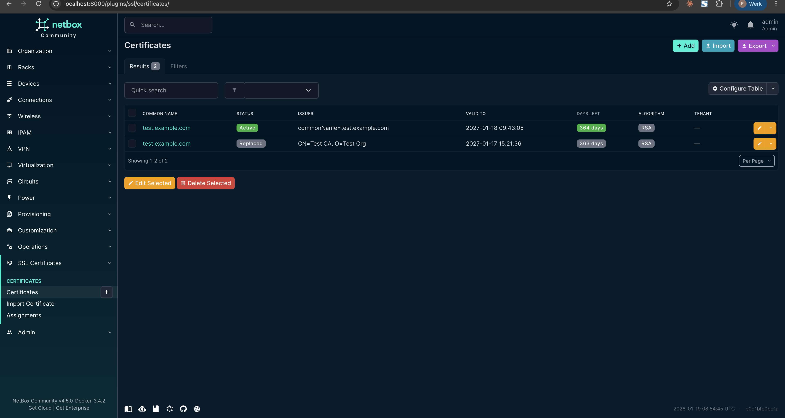
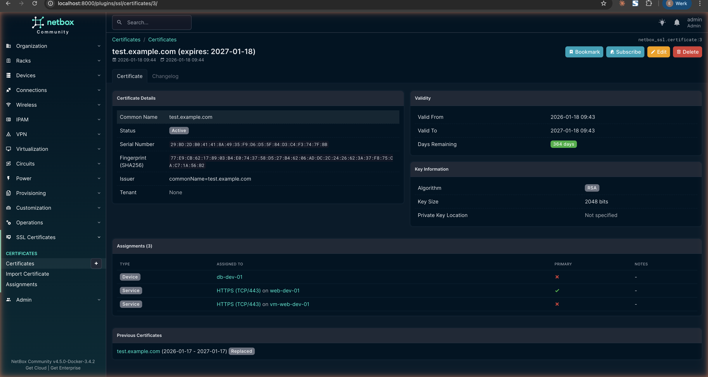
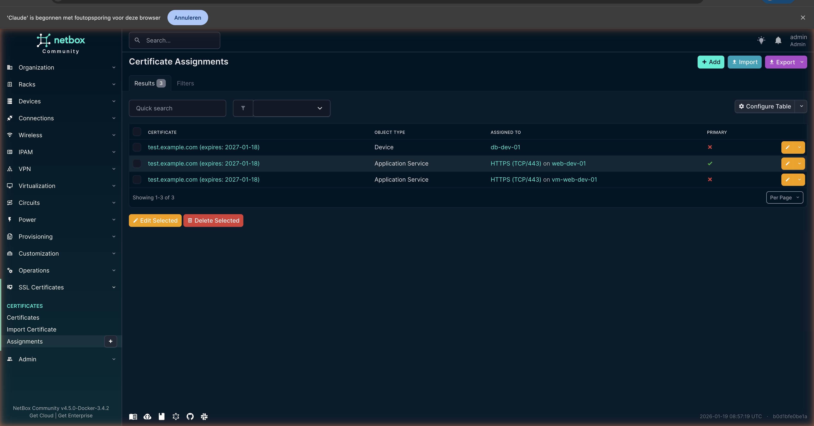
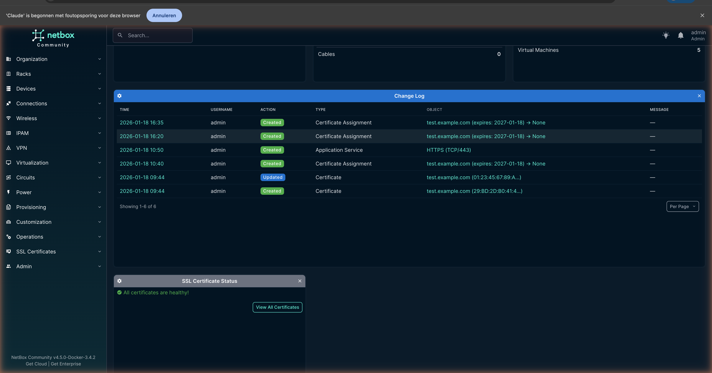

# NetBox SSL Plugin

  <strong>Project Janus</strong> — Your Single Source of Truth for TLS/SSL certificate management

  <em>Named after Janus, the Roman god of doorways and transitions — because every certificate guards a doorway, and every renewal is a transition.</em>

---

Welcome to the **NetBox SSL Plugin** documentation!

Track certificates, monitor expiration dates, and never lose sight of where your certificates are deployed.

  

## Quick Navigation

| Getting Started | Daily Usage | Reference |
|:---------------:|:-----------:|:---------:|
| [Installation](installation.md) | [Usage](usage.md) | [API](api.md) |
| [Configuration](configuration.md) | [Renewal Workflow](usage.md#janus-renewal-workflow) [Scripts](scripts.md) | [Data Models](data-models.md) |

## What Can You Do?

### Track All Your Certificates

Import certificates with a simple paste — the plugin extracts all X.509 attributes automatically. No more spreadsheets or forgotten certificates.

  

### Seamless Renewals with Janus Workflow

When you renew a certificate, the Janus workflow automatically transfers all assignments from the old certificate to the new one and archives the old certificate. No manual updates needed.

### Know Where Every Certificate Lives

Assign certificates to Services, Devices, or Virtual Machines. See at a glance which infrastructure depends on which certificate.

  

### Never Miss an Expiration

The dashboard widget shows certificates that need attention:
- **Critical** — Less than 14 days remaining
- **Warning** — Less than 30 days remaining
- **Orphan** — Not assigned to any infrastructure

  

## Security Philosophy

NetBox SSL is designed with **Passive Administration** in mind:

- **Inventory, not deployment** — The plugin tracks certificates; it doesn't deploy them
- **No private keys** — Private keys are never stored in the database
- **Key location hints** — Document where keys are stored (Vault, HSM, etc.)
- **Private key rejection** — PEM input containing private keys is automatically rejected

## Compatibility

| NetBox Version | Plugin Version | Status |
|:--------------:|:--------------:|:------:|
| 4.5.x          | 0.1.x          | Primary |
| 4.4.x          | 0.1.x          | Supported |
| 4.3.x and older| —              | Unsupported |

## Documentation

- **[Installation](installation.md)** — Get the plugin installed and configured
- **[Configuration](configuration.md)** — Customize thresholds, permissions, and widgets
- **[Usage](usage.md)** — Learn the import and renewal workflows
- **[Scripts](scripts.md)** — Expiry notifications and automation
- **[API](api.md)** — REST API and GraphQL reference
- **[Data Models](data-models.md)** — Database schema and relationships

## Getting Help

- **[GitHub Issues](https://github.com/ctrl-alt-automate/netbox-ssl/issues)** — Report bugs or request features
- **[NetBox Slack](https://netdev.chat/)** — Community chat (#netbox channel)
