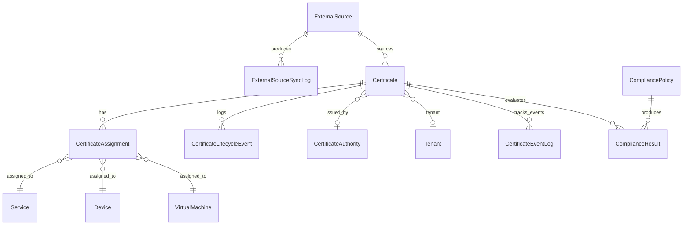

# NetBox SSL — Product Requirements Document

**Project code:** JANUS
**Applies to plugin version:** v1.0.x
**Status:** Canonical — replaces legacy PRDs in `archive/`
**Maintainer:** NetBox SSL team (see `CONTRIBUTING.md`)
**Last updated:** 2026-04-17
**Language:** English (Dutch originals preserved under `archive/`)

> This document is the canonical product specification for NetBox SSL. It
> describes the product as built at v1.0.0 GA, the design principles that
> govern ongoing work, and the architectural decisions behind key trade-offs.
>
> For step-by-step usage and API reference, see the
> [documentation site](https://ctrl-alt-automate.github.io/netbox-ssl/).
> For forward-looking plans, see [ROADMAP.md](ROADMAP.md).

---

## 1. Metadata

**Source of truth:** This document.

**Predecessors (archived):**
- [`archive/2026-01-17-prd-v1-mvp.md`](archive/2026-01-17-prd-v1-mvp.md) — v1.1 MVP spec
- [`archive/2026-03-09-prd-v2-roadmap.md`](archive/2026-03-09-prd-v2-roadmap.md) — v2.0 roadmap

**Revision cadence:** Reviewed per minor release; fully revisited per major release.

---

## 2. Executive Summary

NetBox SSL is a plugin that turns [NetBox](https://github.com/netbox-community/netbox)
into a single source of truth for TLS/SSL certificate inventory. It imports
certificates from PEM, parses every X.509 attribute, links certificates to the
services, devices, and virtual machines that present them, and surfaces
expiry risk before it becomes outage risk.

The product is aimed at infrastructure and security teams already running
NetBox who want certificate visibility without adopting a separate PKI
platform. It is useful for compliance evidence, renewal coordination, and
blast-radius analysis when a CA is deprecated or compromised.

What distinguishes NetBox SSL from alternatives: it is **passive by design**.
It observes and documents; it does not issue, deploy, or rotate certificates.
Private keys are never stored — only public metadata and operator-provided
location hints (e.g., a Vault path). The plugin's value is visibility and
audit trail, deliberately leaving issuance and deployment to the specialised
tooling that already owns those responsibilities.

---

## 3. Product Vision & Design Principles

### 3.1 Passive Administration

**Principle:** NetBox SSL observes and documents the certificate landscape.
It does not issue, deploy, rotate, or revoke certificates.

**Why.** The plugin runs inside the NetBox process. Giving that process the
permissions needed to *act* on certificates (SSH keys for deployment, CA API
credentials, kubeconfig, secrets manager write access) would expand NetBox's
blast radius far beyond its intended role as an inventory. Active tools have
different failure modes — stuck renewals, partial deployments, production
outages — and belong in dedicated platforms (Certbot, cert-manager, ACME
clients) that have access control shaped for that work.

**How it manifests.** The plugin has no outbound credentials for CAs or
devices. The only outbound calls are HTTPS reads of certificate metadata
(ACME Renewal Information, external inventory sources) under shared SSRF
controls. Deployment remains the job of whatever already owned it.

### 3.2 No Private Keys, Ever

**Principle:** The database stores no private keys, encrypted or otherwise.
Parser input containing any private-key header is rejected.

**Why.** Storing private keys alongside certificate metadata concentrates
secrets in a system that is not designed as a secrets manager. Every data
field is accessible to superusers and, via `.restrict()`, to scoped users.
Making NetBox a honeypot is a compliance, audit, and blast-radius problem
with no upside for the plugin's core purpose.

**How it manifests.** A `private_key_location` field stores an operator-
provided hint (e.g., `vault://secret/tls/api.example.com`) pointing at the
secrets manager that *does* own the key. The parser's rejection pattern is
broad and deliberate: `-----BEGIN (RSA|EC|ED25519|...)? PRIVATE KEY-----`
in any form refuses the whole input.

### 3.3 Audit Trail Is Sacred

**Principle:** Certificate history is append-only where possible. Renewals
create new records; they never overwrite existing ones.

**Why.** Operators, auditors, and incident responders need to answer
questions like "what certificate was on the payment endpoint on 2024-06-15?"
An in-place UPDATE of certificate attributes would erase that answer. The
audit requirement is strong enough to justify the slightly higher storage
cost of the replace-and-archive pattern.

**How it manifests.** The Janus renewal workflow creates a new certificate
record, copies every assignment, then marks the old certificate as
`Replaced`. Both remain queryable forever. The `CertificateLifecycleEvent`
table is append-only; status transitions are logged, not mutated.

### 3.4 NetBox-Native

**Principle:** The plugin reuses NetBox's authentication, permissions,
changelog, tenancy, and UI conventions. It does not ship its own.

**Why.** Operators already understand NetBox. Introducing a parallel
permission system, a separate login, or a non-NetBox UI layer would turn
an inventory plugin into a platform migration. Native integration keeps
the cognitive load low and the surface area predictable.

**How it manifests.** Every view inherits from NetBox base classes. Every
queryset uses `.restrict(request.user, ...)`. Every model is scoped by
tenant where relevant. Templates follow NetBox's Bootstrap layout. No
standalone database; the plugin writes to NetBox's schema.

### 3.5 Community-First

**Principle:** The plugin is Apache 2.0 licensed, published on PyPI,
documented publicly, and welcomes external contributions.

**Why.** Certificate inventory is a pervasive but under-served problem
across the NetBox community. A closed or poorly-documented implementation
reinforces the status quo of spreadsheet-based tracking. The goal is a
plugin broad enough to accept diverse operators' requirements without
fragmenting into private forks.

**How it manifests.** Contribution guide, code of conduct, security policy,
issue templates, and PR template all live in the repository. Documentation
is versioned and searchable at
`https://ctrl-alt-automate.github.io/netbox-ssl/`. Every release appears
on PyPI with a CHANGELOG entry.

---

## 4. Scope

### 4.1 In Scope

| Capability | Status |
|------------|:------:|
| Smart Paste Import (PEM with private-key rejection) | ✓ v0.1 |
| Multi-target Assignments (Service, Device, VM via GenericForeignKey) | ✓ v0.2 |
| Janus Renewal Workflow (replace & archive, atomic) | ✓ v0.2 |
| Dashboard expiry widget + analytics dashboard | ✓ v0.5, v0.7 |
| Certificate Authority auto-detection | ✓ v0.4 |
| Chain validation (capped depth) | ✓ v0.5 |
| Compliance policies (tag-scoped from v0.9) | ✓ v0.5, v0.9 |
| CSR tracking | ✓ v0.4 |
| ACME certificate monitoring (15+ providers) | ✓ v0.5 |
| Bulk CSV/JSON/PEM import + bulk operations | ✓ v0.5, v0.8 |
| Multi-format export (CSV, JSON, YAML, PEM) | ✓ v0.5 |
| REST API (15+ actions) + GraphQL | ✓ v0.5 |
| Event/webhook integration via NetBox Event Rules | ✓ v0.6 |
| Scheduled expiry scan (idempotent) | ✓ v0.6 |
| Compliance trend charts + export | ✓ v0.7 |
| Certificate topology map | ✓ v0.7 |
| Lifecycle tracking (state transitions + timeline) | ✓ v0.8 |
| Auto-archive of expired certificates | ✓ v0.8 |
| External Source sync (Lemur, Generic REST) | ✓ v0.8 |
| Granular custom permissions | ✓ v0.9 |
| Performance indexes + lazy PEM loading | ✓ v0.9 |
| DER + PKCS#7 import, diff API, scheduled export | ✓ v0.9 |
| Custom fields + tag-based filtering | ✓ v0.9 |
| ARI monitoring (RFC 9773) | ✓ v0.9 |
| Versioned MkDocs Material documentation site | ✓ v1.0 |
| Load testing suite (Locust) | ✓ v1.0 |

### 4.2 Out of Scope

| Capability | Why out of scope |
|------------|------------------|
| Active deployment of keys to servers | Would require SSH/device credentials — violates passive administration |
| Storage of private keys | Creates a honeypot; private key storage belongs in dedicated secrets managers |
| Full PKI management (issuance, CA operations) | Specialised tools exist; NetBox's strength is documentation |
| Active network scanning | Requires outbound credentials and a different trust model |
| CA API integrations (Let's Encrypt client, DigiCert issuance) | Belongs in ACME clients and certificate managers — we sync from them read-only instead |

### 4.3 Explicit Non-Goals

- **Never an ACME client.** Certbot and acme.sh already own that role; the plugin syncs the resulting certificates read-only via the External Source framework.
- **Never broker CA issuance.** Operators talk directly to their CA; the plugin records the outcome.
- **Never push TLS config to load balancers or appliances.** Deployment belongs in Ansible, Terraform, Salt, Kubernetes, and the like.
- **Never decrypt TLS traffic.** The plugin never handles live traffic, only metadata.
- **Never run outbound scans for discovery.** Passive ingestion from an existing scanner's output is the correct pattern.
- **Never store credentials for external systems as plaintext.** All external-source credentials use the `env:VAR_NAME` reference pattern, enforced in code.

---

## 5. Architectural Decision Records

Architectural Decision Records (ADRs) capture the *why* behind design
choices. Each ADR states the context, the decision, the consequences that
follow, and the alternatives that were considered and rejected.

### 5.1 ADR-01: Passive over Active

**Status:** Accepted 2026-01-17. Reaffirmed at v1.0 GA (2026-04-16).

**Context.** Certificate management has two camps: inventory tools
(observe, document, alert) and deployment tools (issue, push, rotate).
Combining both in a single plugin would require elevated credentials,
complex failure-mode handling, and a much larger blast radius if
compromised.

**Decision.** NetBox SSL is strictly passive. It observes and documents.
It does not issue, push, rotate, or revoke certificates. Active behaviour
is explicitly rejected.

**Consequences.** The plugin has a minimal credential footprint (read-only
outbound HTTPS for ARI and external sources). Integrations with ACME
clients, cert-manager, CA APIs, and deployment tools are one-way (pull
metadata in, never push out). Operators retain their existing deployment
workflows unchanged.

**Alternatives considered.**
- *Active ACME client.* Rejected — specialised tooling already exists
  and operators are already comfortable with it.
- *Certificate push to devices.* Rejected — expands the trust boundary
  to SSH, kubeconfig, device APIs, all of which are owned by different
  tools with different access models.
- *Dual-mode (passive by default, active opt-in).* Rejected — the
  opt-in path would still require us to build the active path, and the
  security story becomes conditional.

### 5.2 ADR-02: No Private Key Storage

**Status:** Accepted 2026-01-17. Reaffirmed at v1.0 GA (2026-04-16).

**Context.** Early design raised the option of storing encrypted private
keys alongside certificate metadata, so that the plugin could offer
"complete asset management". Every field stored in NetBox is accessible
to superusers and, via `.restrict()`, to scoped users. Private keys would
make the NetBox database a concentration of secrets.

**Decision.** The database stores no private keys, encrypted or otherwise.
The parser actively rejects input containing any private-key header.
A free-text `private_key_location` field holds an operator-provided hint
pointing at the secrets manager that *does* own the key.

**Consequences.** The NetBox database cannot be used to decrypt traffic,
impersonate endpoints, or forge certificates. The plugin avoids an entire
class of compliance obligations around key management. Operators must run
a separate secrets manager — which they typically already do.

**Alternatives considered.**
- *Encrypted key storage with per-tenant keys.* Rejected — moves the
  secret one level, does not remove it.
- *Write-only API for private keys.* Rejected — still a honeypot from
  the perspective of anyone who compromises the NetBox host.
- *Optional per-install toggle.* Rejected — makes the security story
  conditional and undermines the "never a honeypot" guarantee.

### 5.3 ADR-03: Replace & Archive (Janus Workflow)

**Status:** Accepted 2026-01-17.

**Context.** When an operator renews a certificate, two data models are
possible: update the existing record with the new attributes, or create
a new record and archive the old one.

**Decision.** Renewal creates a new `Certificate` record, copies every
`CertificateAssignment` to the new record, and marks the old certificate
as `Replaced`. Both live in the database forever; the relationship is
captured by `CertificateLifecycleEvent` entries linking old and new.

**Consequences.** Certificate history is complete: operators can answer
"what certificate was on endpoint X on date Y?" without archaeology.
Rollback is first-class — if the new certificate is bad, flip the old
one back to `Active` and re-point assignments. Storage cost grows
linearly with renewal count; at typical inventory sizes (hundreds to
low thousands) this is negligible, and the v0.8 auto-archive policy
lets operators prune very old records when desired.

**Alternatives considered.**
- *In-place UPDATE.* Rejected — destroys audit trail; rollback becomes
  archaeology from the changelog.
- *Soft-delete with a flag.* Rejected — does not solve the renewal
  chain problem; the new and old certificates still need distinct
  identities.

### 5.4 ADR-04: Chain as Metadata, Not Entities

**Status:** Accepted 2026-01-17.

**Context.** Certificates have intermediate and root CAs. One option is
to model each CA as a first-class database object; another is to store
the chain as metadata on the leaf certificate.

**Decision.** The chain is stored as plain metadata (JSON/text) on the
leaf certificate. Intermediate CAs are not first-class entities, though
a `CertificateAuthority` model exists for *issuing* CAs that the operator
wants to track explicitly.

**Consequences.** Imports stay simple — no recursive parent-lookup. The
database is not polluted with certificates the operator doesn't manage.
Search and filter still work ("show me all certificates from DigiCert
G2") because issuer strings are indexed. The downside: no graph view of
intermediate CA relationships. Acceptable at the current scope.

**Alternatives considered.**
- *Full PKI hierarchy as entities.* Rejected — recursive lookups on
  every import, database growth driven by non-operator certificates,
  complexity without proportional value.
- *No chain storage at all.* Rejected — operators often need chain
  validation results, which require the chain to be present.

### 5.5 ADR-05: GenericForeignKey for Assignments

**Status:** Accepted 2026-01-17.

**Context.** A certificate can be assigned to a Service, a Device, or a
Virtual Machine. Modelling this as three parallel M2M tables would
duplicate logic and make "show all assignments for certificate X" harder.

**Decision.** `CertificateAssignment` uses a `GenericForeignKey` so one
table can point at any of the three target types. The recommended
assignment target is `Service` (port-level granularity), because a
Device-only assignment cannot distinguish between certificates on
different ports.

**Consequences.** One table, one query for "all assignments of
certificate X". Reverse lookups ("what certificates are on this device?")
work through NetBox's `GenericRelation`. The trade-off: ordering by
`assigned_object` needs `orderable=False` in django-tables2 because
`GenericForeignKey` has no reverse relation that django-tables2 can
use for SQL ORDER BY. Documented workaround.

**Alternatives considered.**
- *Three parallel M2M tables (cert↔service, cert↔device, cert↔vm).*
  Rejected — three times the schema, three times the views, three
  times the filter logic.
- *Single target-ID column with a type enum.* Rejected — loses Django's
  integrity checks; we'd hand-roll them.

### 5.6 ADR-06: External Sources as Read-Only Sync

**Status:** Accepted 2026-03-09 (introduced in v0.8).

**Context.** Many organisations already run certificate managers (Lemur,
DigiCert CertCentral, Venafi). Manual re-entry of every certificate into
NetBox SSL would make the plugin dead weight; an active two-way sync
would violate passive administration.

**Decision.** The External Source framework provides **read-only**
ingestion from external systems. Adapters fetch certificate metadata,
never private keys (enforced in code), under shared SSRF controls. Sync
runs in four phases (FETCH → DIFF → APPLY → LOG) inside a single
transaction.

**Consequences.** Operators can keep their existing issuance workflow
and still get NetBox SSL inventory. The upstream system remains the
authority for the certificate; the plugin is the authority for
assignments and context within NetBox. If the upstream is removed,
NetBox SSL does *not* auto-delete — it flags the record with
`source_removed` for operator review.

**Alternatives considered.**
- *Two-way sync.* Rejected — conflict resolution, write credentials
  upstream, and violation of passive administration.
- *Manual CSV re-export.* Rejected — operator-hostile, doesn't scale.
- *No sync, Smart Paste only.* Rejected — limits the plugin's
  usefulness in existing deployments.

### 5.7 ADR-07: Versioned Documentation Site

**Status:** Accepted 2026-04-16 (introduced at v1.0.0 GA).

**Context.** The plugin's documentation initially lived as flat Markdown
in `docs/`. As the plugin matured toward GA, the community needed a
searchable, navigable, versioned documentation site that could serve
multiple plugin versions concurrently.

**Decision.** Documentation uses [MkDocs Material](https://squidfunk.github.io/mkdocs-material/)
with [mike](https://github.com/jimporter/mike) for version management,
deployed to GitHub Pages on every tagged release. Structure follows the
[Diátaxis framework](https://diataxis.fr/) hybrid: Tutorials, How-To,
Reference, Operations, Development, Explanation.

**Consequences.** Documentation is searchable, dark-mode capable, and
version-switching works from any page. Published at
`https://ctrl-alt-automate.github.io/netbox-ssl/`. Build is enforced
strict in CI (`mkdocs build --strict`) so broken links never ship.

**Alternatives considered.**
- *Read the Docs.* Rejected — GitHub Pages is already the deployment
  target for CI artefacts and requires no external account.
- *Flat Markdown in `docs/`.* Rejected at v1.0 — no search, no version
  switching, no cross-linked navigation.
- *Docusaurus or VitePress.* Rejected — MkDocs Material is the
  standard in the Python documentation ecosystem; NetBox itself uses
  MkDocs.

---

## 6. Data Model Overview

### 6.1 Core Entities

- **Certificate** — a unique X.509 certificate record; the library item that assignments and lifecycle events point at.
- **CertificateAssignment** — links a Certificate to a target via `GenericForeignKey` (Service, Device, VirtualMachine).
- **CertificateAuthority** — issuing CA record, with auto-detection from the issuer string.
- **CertificateSigningRequest** — tracked CSR, optionally linked to the Certificate it produced.
- **CertificateLifecycleEvent** — append-only log of status transitions, renewals, assignment changes.
- **CertificateEventLog** — idempotency tracker for the expiry scan (prevents duplicate events within a cooldown window).
- **CompliancePolicy** / **ComplianceResult** / **ComplianceTrendSnapshot** — per-policy checks, historical outcomes, and time-series trend data.
- **ExternalSource** / **ExternalSourceSyncLog** — read-only sync configuration and per-run audit log for third-party certificate managers.

### 6.2 Relationship Diagram



### 6.3 Field-Level Details

Field definitions, choices, constraints, and indexes are documented in
the [data models reference](https://ctrl-alt-automate.github.io/netbox-ssl/reference/data-models/)
on the documentation site. This PRD does not duplicate that content.

---

## 7. Core Workflows

### 7.1 Smart Paste Import

Operator pastes raw PEM into a single text area. The backend rejects any
input containing a private-key header, then uses the Python `cryptography`
library to extract CN, SANs, validity window, issuer, fingerprint,
algorithm, and key size. Duplicate detection is by `serial_number + issuer`.
Parsed metadata is presented in a preview before the record is created.

→ [Tutorial: Your First Certificate Import](https://ctrl-alt-automate.github.io/netbox-ssl/tutorials/01-first-import/)

### 7.2 Janus Renewal

When an imported PEM has the same Common Name as an existing `Active`
certificate, the UI surfaces the Janus dialog. "Renew & Transfer" creates
the new record, migrates every assignment to it, and marks the old record
as `Replaced` — all inside one database transaction. Both records stay in
the history.

→ [Tutorial: Janus Renewal Workflow](https://ctrl-alt-automate.github.io/netbox-ssl/tutorials/02-renewal-workflow/)

### 7.3 Expiry Monitoring

A scheduled `CertificateExpiryScan` script computes `days_remaining` for
every `Active` certificate. Certificates crossing a configured threshold
fire a NetBox event, which Event Rules route to webhooks (Slack, Teams,
PagerDuty). An idempotency log (`CertificateEventLog`) prevents duplicate
alerts within a cooldown window.

→ [Tutorial: Expiry Monitoring](https://ctrl-alt-automate.github.io/netbox-ssl/tutorials/03-expiry-monitoring/)

### 7.4 External Source Sync

Operators register an `ExternalSource` (e.g., Lemur, or a generic REST
endpoint). A scheduled `ExternalSourceSync` script runs the adapter's
four-phase sync: FETCH upstream metadata, DIFF against local state,
APPLY changes inside a transaction, LOG the outcome. Credentials use the
`env:VAR_NAME` pattern; private keys are never fetched.

→ [How-to: External Sources](https://ctrl-alt-automate.github.io/netbox-ssl/how-to/external-sources/)

### 7.5 Bulk Operations

CSV, JSON, PEM, DER, and PKCS#7 bulk imports go through the bulk import
page with a preview-before-confirm flow. Bulk status updates, bulk
assignments, bulk compliance checks, and bulk chain validation all
enforce per-operation custom permissions (introduced in v0.9) and are
available via both UI and API.

→ [How-to: Bulk Import](https://ctrl-alt-automate.github.io/netbox-ssl/how-to/bulk-import/)

---

## 8. Non-Functional Requirements

### 8.1 Security

Layered controls, each enforced independently:

- **Private-key rejection** — parser refuses any input containing a private-key header (broad regex match across RSA, EC, Ed25519, and generic PRIVATE KEY forms).
- **PEM size cap** — `max_length=65536` on form fields plus a size guard in the parser.
- **SSRF guards** — shared `utils/url_validation.py` enforces HTTPS-only, DNS resolution to public IPs only, no redirect following, and streaming-response size caps on all outbound calls (ARI polling, external-source sync).
- **Permission model** — all views inherit `LoginRequiredMixin`; all querysets use `.restrict(request.user, "view"/"change")`; all write actions check `has_perm()`; custom permissions (`import_certificate`, `renew_certificate`, `bulk_operations`, `manage_compliance`) enable granular RBAC.
- **CSV injection prevention** — export sanitises formula-triggering characters in CSV values.
- **Credential pattern** — external-source credentials reference `env:VAR_NAME` only; raw credentials are rejected by validation and never appear in API responses (serializer field is `write_only`).

### 8.2 Performance

Targets, validated by the Locust load-test suite documented in
[operations/load-testing](https://ctrl-alt-automate.github.io/netbox-ssl/operations/load-testing/):

- List endpoint p95 < 500 ms at 50 concurrent users
- Filter endpoint p95 < 500 ms at 25 concurrent users
- Import endpoint p95 < 500 ms at 10 concurrent users
- Success rate ≥ 95% for all scenarios

Implementation details: 9 database indexes on `Certificate` covering common filter combinations; conditional field deferral (heavy PEM content omitted on list views); connection pooling inherits from NetBox.

### 8.3 Compatibility

- **NetBox:** primary 4.5.x, supported 4.4.x (N and N-1 strategy). Earlier versions unsupported.
- **Python:** 3.10, 3.11, 3.12 (all tested in CI).
- **Platforms:** macOS and Linux for development; runs anywhere NetBox runs.
- **Browser:** Chrome, Safari, Firefox desktop. Mobile best-effort.

### 8.4 Observability

- NetBox Event Rules pick up `certificate.imported`, `certificate.renewed`, `certificate.expired`, `certificate.expiring_soon`, `certificate.revoked`, and `certificate.ari_window_shift` events.
- Every external-source sync writes an `ExternalSourceSyncLog` with run counts and duration.
- The expiry scan writes `CertificateEventLog` entries for idempotency and audit.
- Django-level logging is structured; no `print()` calls in production code paths.

### 8.5 Deployability

- Published on PyPI (`pip install netbox-ssl`).
- No external services required beyond what NetBox itself needs (PostgreSQL, Redis).
- Plugin settings fully in `PLUGINS_CONFIG`; no environment-variable requirements for the plugin to start.
- Zero-downtime upgrade path for every release documented in
  [operations/upgrading](https://ctrl-alt-automate.github.io/netbox-ssl/operations/upgrading/).

---

## 9. Success Metrics

### 9.1 Adoption

| Metric | Current (2026-04-17) | Target |
|--------|----------------------|--------|
| PyPI package published | ✓ v1.0.0 | — |
| PyPI downloads per month | Track post-v1.0 | ≥ 500 within 12 months |
| GitHub stars | Track | ≥ 50 within 12 months |
| GitHub forks | Track | ≥ 10 within 12 months |

### 9.2 Quality

| Metric | Current | Target |
|--------|---------|--------|
| Unit test coverage on `netbox_ssl/utils/` | 72% | ≥ 70% CI gate |
| Integration tests in CI | NetBox 4.4 + 4.5 | — |
| Bandit findings (high / medium) | 0 | 0 |
| Known CVEs in declared dependencies | 0 | 0 |
| Security review checklist | Living | Reviewed per minor release |

### 9.3 Release Cadence

| Metric | Current | Target |
|--------|---------|--------|
| SemVer adherence | ✓ | — |
| CHANGELOG entry per release | ✓ | — |
| Time-to-patch a high-severity issue | Baseline at v1.0 | ≤ 14 days |

### 9.4 Community

| Metric | Current | Target |
|--------|---------|--------|
| External contributors | Tracked | ≥ 3 within 12 months |
| Median issue turnaround | Tracked | ≤ 5 business days |
| `good-first-issue` labelled issues open | ✓ | Keep ≥ 3 available |

---

## 10. Document Governance

### 10.1 Update Triggers

| Trigger | Action |
|---------|--------|
| New minor release (v1.1, v1.2, …) | Review PRD: any ADR added? scope change? |
| New major release (v2.0, …) | Full review + version bump in metadata |
| New architectural decision | Add ADR to §5 + CHANGELOG entry |
| Docs site restructure | Update links in §6 and §7 |

### 10.2 Version Field Convention

The "Applies to plugin version" field in the metadata block tracks the
plugin version. No separate PRD semver — single source of truth is the
plugin version. "Last updated" is maintained manually with each change.

### 10.3 Relationship to Other Documents

```
PRD.md (stable)                 → why + principles + ADRs
ROADMAP.md (living)             → what comes next
CHANGELOG.md (append-only)      → what has shipped
docs/ (MkDocs site)             → how to use it
docs/superpowers/specs/         → brainstorm artefacts
docs/superpowers/plans/         → implementation plans
```

Each layer has one purpose; overlap is the exception, not the rule.

### 10.4 Document Changelog

| Date | Change |
|------|--------|
| 2026-04-17 | Initial consolidation from legacy PRDs v1.1 and v2.0 (now in `archive/`). Charter structure with ADR log. |
